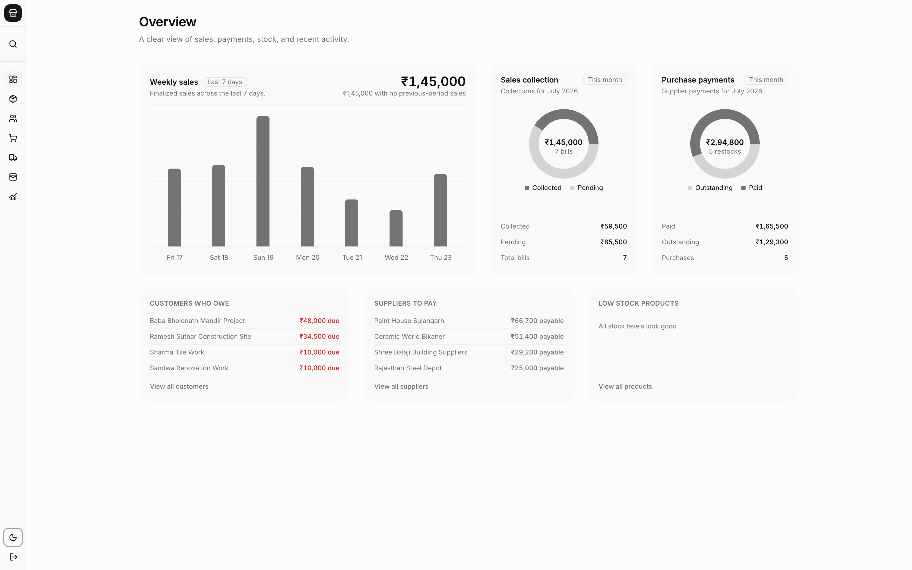
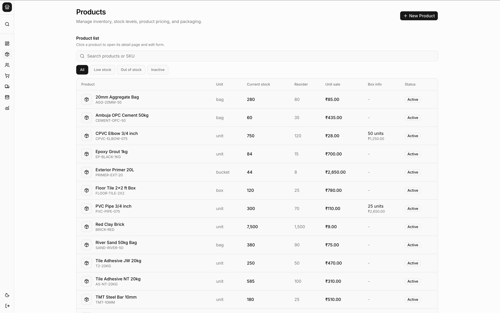
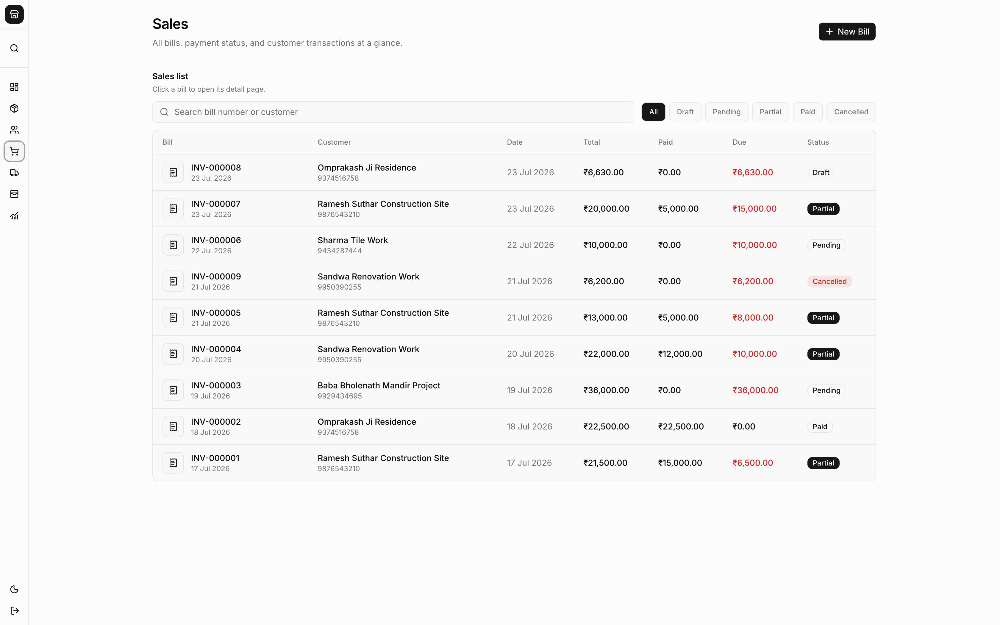
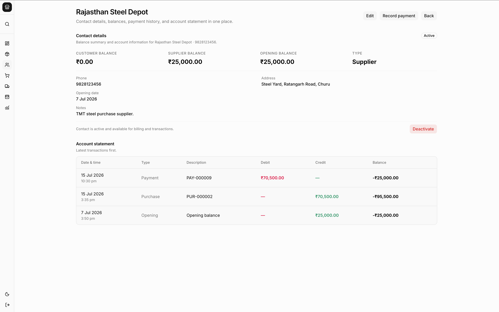
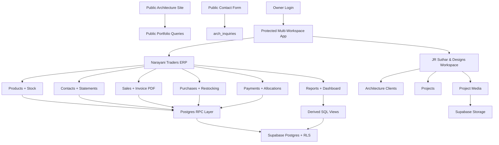

# JR Suthar & Designs + Narayani Traders ERP

A production-minded, multi-workspace business application built for two real operating contexts:

- **Narayani Traders ERP**: billing, inventory, customers, suppliers, payments, statements, reports, and printable invoices for a building-materials store.
- **JR Suthar & Designs**: architecture portfolio operations, client/project management, media publishing, public portfolio pages, and incoming inquiries.

The project is designed as a serious internal tool rather than a demo dashboard. It combines authenticated business workflows, database-backed accounting logic, stock movements, payment allocation, public portfolio publishing, and polished customer-facing pages inside one Next.js application.

## Product Screenshots

### Narayani Traders ERP

<table>
  <tr>
    <td width="50%">
      
      <br />
      <sub><strong>ERP overview</strong> with sales, collections, supplier payables, and stock health.</sub>
    </td>
    <td width="50%">
      
      <br />
      <sub><strong>Inventory control</strong> with products, stock, reorder levels, unit pricing, and box packaging.</sub>
    </td>
  </tr>
  <tr>
    <td width="50%">
      
      <br />
      <sub><strong>Sales and billing</strong> with draft, pending, partial, paid, and cancelled invoice states.</sub>
    </td>
    <td width="50%">
      
      <br />
      <sub><strong>Account statements</strong> with customer/supplier balances, payment history, and running ledger.</sub>
    </td>
  </tr>
</table>

### JR Suthar & Designs

<table>
  <tr>
    <td width="50%">
      
      <br />
      <sub><strong>Architecture dashboard</strong> with searchable project cards, visibility state, and featured work.</sub>
    </td>
    <td width="50%">
      
      <br />
      <sub><strong>Project media workspace</strong> with client details, cover image control, and gallery management.</sub>
    </td>
  </tr>
</table>

## Why This Exists

Many small businesses run on disconnected tools: WhatsApp for customers, notebooks for dues, spreadsheets for stock, and manual invoice edits. This project turns those workflows into a single operational system with a clean UI and a database model that protects accounting correctness.

The architecture studio side solves a different but related problem: portfolio work should be managed once in the dashboard and then published directly to a public landing page. The same app therefore supports both internal ERP operations and public-facing brand presentation.

## What Has Been Built

### Multi-Workspace Shell

- Collapsed, icon-first sidebar with tooltips.
- Team/workspace switcher for `Narayani Traders ERP` and `JR Suthar & Designs`.
- ERP-only global search entry in the sidebar.
- Theme toggle and logout in the sidebar footer.
- Protected dashboard layout with centered content width.

### ERP Overview Dashboard

- Weekly sales chart using shadcn chart primitives and Recharts.
- Sales collection donut: collected vs pending.
- Purchase payment donut: paid vs outstanding.
- Attention sections for customer dues, supplier payables, and low-stock products.
- Server-side Supabase reads with derived views for financial state.

### Products

- Product list with search/filter.
- Dedicated create route: `/products/new`.
- Dedicated detail/edit route: `/products/[id]`.
- Unit and box pricing support.
- Stock on hand, reorder level, cost price, sale price, and active state.
- Stock correction support through backend RPCs.

### Contacts

- Customer, supplier, both, and walk-in contact support.
- Optional address field for invoice output.
- Contact detail page with balance summary and account statement.
- Statement ordered by exact entry timestamp.
- Opening balance handling with customer/supplier-specific wording.
- Record payment directly from contact detail.

### Sales / Billing

- One-shot invoice creation flow: customer resolution, item entry, payment, totals, and finalization in a single page.
- Type a customer name and auto-select an existing contact when matched.
- Create a new customer during bill creation when no match exists.
- Product combobox search with default shadcn behavior.
- Stock-safe sale finalization.
- Sale detail page with payment history, record-payment action, cancel action, and print/download links.
- Printable invoice page and downloadable PDF invoice.
- QR/payment footer, bank details, previous-balance handling on latest invoice only, and compact PDF layout.

### Purchases / Restocking

- One-shot purchase creation flow mirroring sales.
- Type/select supplier with automatic creation when needed.
- Product auto-resolution and purchase cost entry.
- Stock-in behavior on finalize.
- Supplier payment recording from purchase detail.
- Cancel purchase with stock-safety checks.
- Optional product-cost update behavior controlled by backend defaults.

### Payments

- Payments list and payment detail pages.
- Customer receipts and supplier payments.
- Daily payment totals.
- Manual allocation for remaining advances.
- Reverse payment workflow.
- Account-aware allocation status:
  - applies payments to opening balances,
  - allocates advances against pending bills/purchases,
  - reports only true remaining advance as unallocated.

### Reports

- Sales report.
- Purchase report.
- Payment report.
- Stock report.
- Contact balance report.
- Product profit report.
- Compact report selector buttons matching the rest of the UI.

### Architecture Portfolio Workspace

- JR Suthar & Designs workspace inside the authenticated app.
- Project list with search and public/private/featured filters.
- Create project page with client and project details.
- Project detail page with edit/delete actions.
- Multi-image upload with pending preview state.
- First uploaded image becomes cover by default.
- Media ordering, cover image control, public/private media flags.
- Inquiry list for public contact form submissions.

### Public Architecture Site

- Minimal motion-based landing page.
- Full-viewport hero section.
- Public project grid and project detail pages.
- Studio profile page.
- Contact page with Supabase-backed inquiry form.
- Public pages forced into light mode so they are not affected by the app theme.
- Auto-hiding glass-style public header with project scroll behavior.

## Backend And Data Model

The backend is Supabase/Postgres-first. Core write operations are modeled as RPCs rather than scattered client mutations.

Core ERP tables:

- `contacts`
- `products`
- `sales`
- `sale_items`
- `purchases`
- `purchase_items`
- `payments`
- `payment_allocations`
- `stock_movements`
- `shop_settings`

Architecture portfolio tables:

- `arch_clients`
- `arch_projects`
- `arch_project_media`
- `arch_inquiries`

Important derived views and logic:

- `sale_balances`
- `purchase_balances`
- `contact_balances`
- `contact_statement`
- `daily_payment_totals`
- `stock_reconciliation`
- `payment_allocation_status`
- idempotency support for write RPCs
- owner-only RLS policies
- payment reversal model
- stock-safe sale/purchase cancellation

## Technical Highlights

- **Next.js 16 App Router** with Server Components and Server Actions.
- **React 19** and TypeScript.
- **Supabase Auth, Postgres, Storage, RLS, and RPCs**.
- **shadcn/ui + Base UI** for the component system.
- **Tailwind CSS v4** for styling.
- **Recharts via shadcn charts** for dashboard/report visualizations.
- **PDFKit** for server-generated invoice downloads.
- **Motion** for public portfolio page transitions.
- **Sonner** for mutation feedback.

## Architecture



## Repository Structure

```text
app/
  (app)/                    protected dashboard workspaces
  architecture/             public studio profile + contact
  projects/[id]/            public portfolio project detail
  page.tsx                  public landing page

components/
  dashboard/                ERP overview UI
  products/                 product list/create/detail
  contact/                  contacts, statements, quick fields
  sales/                    sales creation, detail, invoice print
  purchases/                purchase creation/detail
  payments/                 payment list/detail/allocation
  portfolio/                architecture workspace
  public-site/              public landing/project/contact UI
  ui/                       shadcn/Base UI components

lib/
  dashboard/                dashboard data and formatting
  invoice/                  invoice data and business profile
  portfolio/                portfolio data/upload/public queries
  reports/                  reports data
  supabase/                 Supabase clients

supabase/migrations/        schema, RPCs, policies, reset utilities
```

## Local Development

Install dependencies:

```bash
npm install
```

Create `.env` from `.env.example`:

```bash
cp .env.example .env
```

Required environment variables:

```env
OWNER_EMAIL=
OWNER_PASSWORD=
SUPABASE_URL=
SUPABASE_ANON_KEY=
SUPABASE_SERVICE_ROLE_KEY=
DATABASE_URL=
```

Run the app:

```bash
npm run dev
```

Run validation:

```bash
npm run lint
npm run typecheck
npm run build
```

Backend helpers:

```bash
npm run backend:create-owner
npm run backend:test
```

Important: review migrations before applying them to an existing database. This repository includes ERP reset migrations used during development and production cleanup. Architecture portfolio tables are intentionally preserved by the latest ERP-only reset migration.

## Current Status

The application is ready for fresh ERP data entry after the latest reset. The architecture portfolio data is preserved and already wired to the public landing/project pages.

This repo demonstrates:

- end-to-end product thinking,
- real workflow modeling,
- protected enterprise-style CRUD,
- accounting-aware backend design,
- media-backed public publishing,
- and a polished UI layer across internal and public surfaces.
